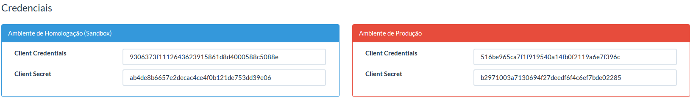

Biblioteca para consumo da API do UniPago
=====

Esta biblioteca foi desenvolvida para facilitar a utilização da API do Unipago, oferencendo todos os recursos disponíveis de forma prática e simplificada.
Para a correta utilização deste SDK, é necessária a utilização da Linguagem PHP com versão igual ou superior a 5.5.0.

Documentação das entradas e saidas

## Rotas disponíveis para Clientes

```
GET     /unipago/cliente
POST    /unipago/cliente
GET     /unipago/cliente/$id
PUT     /unipago/cliente/$id
DELETE  /unipago/cliente/$id
```

## Rotas disponíveis para Cobranças

```
GET     /unipago/cobranca
GET     /unipago/cobranca/$id
POST    /unipago/cobranca
```

## Criando uma conexão com a API do Unipago

Inclua o arquivo de autoload de seu projeto

```
require '../vendor/autoload.php';
```

Adicione as depêndências necessárias
```
use UnipagoApi\Connection;
use UnipagoApi\Resource;
```

Configure a conexão para a API. 
```
$client_id = 'SEU CLIENT ID';
$client_secret = 'SEU CLIENT SECRET';
$conexao = new Connection(Connection::SCOPE_SANDBOX, $client_id, $client_secret);
```

## Chaves de Acesso

Os parâmetros <b>Client ID</b> e <b>Client Secret</b> podem ser obtidos ao acessar a ferramenta [Unipago](https://unipago.com.br) ,
efetuar o login e accesar o menu <b>Configurações -> API</b>.



Caso suas credenciais ainda não tenham sido criadas, é necessário clicar no botão <b>Criar Chaves de Acesso</b>


Como pode ser visto, existem dois ambientes para utilização da API do Unipago. O Ambiente de <b>Produção</b> permite acesso aos dados reais do cliente e deve ser utilizado com cautela. Já o ambiente <b>Sandbox</b> é um espaço oferecido para testes, onde nenhuma ação tomada irá interferir nos dados reais. Uma vez em posse de todos os dados necessários, podemos finalmente criar a conexão com a API do Unipago.

Nota: Os ambientes são divididos pelas chaves e escopos específicos. Para utilizar o ambiente de <b>Produção</b>, você deve usar a constante <b>Connection::SCOPE_PRODUCTION</b> e seus respectivos dados de acesso. Para utilizar o ambiente de <b>Sandbox</b>, você deve usar a constante <b>Connection::SCOPE_SANDBOX</b> e seus respectivos dados de acesso.

## Utilizando recursos da API - Clientes

Para realizar operações relativas a clientes, é necessário instanciar um novo recurso de clientes. Um exemplo pode ser visto abaixo.

```
$recursoCliente = new Resource\Cliente($conexao);
```

Utilizando o recurso criado, podemos realizar as seguintes operações:

Listagem de clientes

```
$clientes = $recursoCliente->listar();
```

Buscar um cliente específico

```
$cliente = $recursoCliente->buscar(1000);
```

Buscar um cliente específico

```
$resultado = $recursoCliente->deletar(1000);
```

Criar um cliente

```
$cliente = $recursoCliente->criar($dados);
```

Alterar um cliente

```
$cliente = $recursoCliente->editar(1000, $dados);
```

## Utilizando recursos da API - Cobranças

Para realizar operações relativas a cobranças, é necessário instanciar um novo recurso de cobranças. Um exemplo pode ser visto abaixo.

```
$recursoCobranca = new Resource\Cobranca($conexao);
```

Utilizando o recurso criado, podemos realizar as seguintes operações:

Listagem de cobranças

```
$cobrancas = $recursoCobranca->listar();
```

Buscar uma cobrança específica

```
$cobranca = $recursoCobranca->buscar($id_cobranca);
```

Criar uma cobrança

```
$cobranca = $recursoCobranca->criar($dados);
```

## Verificação de erros
É possível verificar a existência de erros ocorridos após qualquer operação executada utilizando esta biblioteca. Um exemplo pode ser visto abaixo.

```
$cliente = $recursoCliente->criar($dados);
$recursoCliente->getErros();
```

Caso tenha ocorrido algum erro, o retorno deverá ser um array como o do exemplo abaixo.
```
Array
(
    [0] => stdClass Object
        (
            [status] => 412
            [title] => O campo telefone_principal deve ser informado
            [meta] => stdClass Object
                (
                    [type] => telefone_principal
                )

        )

    [1] => stdClass Object
        (
            [status] => 412
            [title] => O CPF/CNPJ informado é inválido
            [meta] => stdClass Object
                (
                    [type] => cpf_cnpj
                )

        )

)
```
